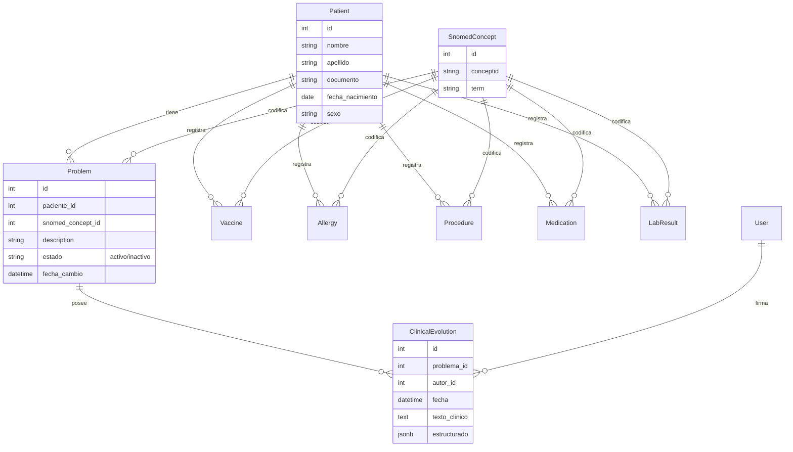

# POMR EHR - Documentación de Arquitectura

Este documento consolida el plan arquitectónico, el modelo de datos y las decisiones técnicas tomadas durante el desarrollo inicial del sistema de Historia Clínica Electrónica Orientada a Problemas (POMR EHR).

## Resumen de Arquitectura

El sistema está construido siguiendo un patrón arquitectónico desacoplado y orientado a servicios:

### 1. Backend (FastAPI + Python 3.11)
- **Framework:** FastAPI, garantizando alta escalabilidad, uso de I/O asíncrono y documentación OpenAPI/Swagger generada automáticamente.
- **ORM:** SQLAlchemy 2.0 (asíncrono) para el mapeo relacional de objetos.
- **Base de Datos:** PostgreSQL.
- **Migraciones:** Alembic.
- **Seguridad:** JWT (JSON Web Tokens) usando Passlib (bcrypt) para el hasheo y python-jose para la emisión de tokens.
- **Patrón de Diseño:** Diseño orientado a dominio con capas lógicas:
  - `routers`: Controladores de la API (Endpoints).
  - `schemas`: Pydantic models para la validación de entrada/salida.
  - `services`: Reglas de negocio y consultas limpias a la base de datos.
  - `models`: Modelos SQLAlchemy puros.
  - `interoperability`: Módulo desacoplado para generación de recursos FHIR.

### 2. Frontend (React + TypeScript)
- **Build Tool:** Vite.
- **UI Framework:** Material UI (MUI).
- **Manejo de Estado Global:** Zustand (ligero y reactivo).
- **Data Fetching / Caché:** TanStack Query (React Query).
- **Ruteo:** React Router DOM.
- **Patrón de Diseño UI:** Espacio clínico (Workspace) con panel lateral contextual para navegación rápida e inmersiva.

### 3. Interoperabilidad (HL7 FHIR)
- Sistema "FHIR-ready" que cuenta con mapeos manuales de entidades internas a estándares HL7 FHIR (ej: `Problem` a `Condition`, `Patient` a `Patient`).
- Cliente `httpx` asíncrono configurado para empujar eventos a un Health Information Exchange (HIE) central.

### 4. DevOps y CI/CD
- **Docker:** `Dockerfile` multi-stage independientes para frontend (Node/Nginx) y backend (Python/Uvicorn).
- **Orquestación Local:** `docker-compose.yml` pre-configurado para levantar la base de datos.
- **GitHub Actions:** Pipeline `.github/workflows/ci.yml` con pruebas automatizadas usando Pytest.

---

## Modelo de Datos Clínicos (Entidad-Relación)

A continuación se detalla el modelo estructural en sintaxis Mermaid. Está enfocado estrictamente en un modelo clínico POMR centrado en el Paciente y codificado bajo terminología SNOMED.

---

## Registro de Implementación (Fases Completadas)

### Fase 1: Fundaciones
- Creación de Monorepo `pomr-ehr`.
- Configuración de la base de datos PostgreSQL en Docker Compose.
- Inicialización de FastAPI y dependencias (`fastapi`, `sqlalchemy`, `asyncpg`, `alembic`, `pydantic`).
- Creación del modelo relacional completo.

### Fase 2: Desarrollo de API Rest
- Se implementaron los flujos de Autenticación y Autorización (JWT).
- Se programaron los servicios CRUD clínicos (Pacientes, Problemas, Evoluciones y Registros Auxiliares).
- Se configuraron los enrutadores `/patients`, `/problems`, `/evolutions` y `/records`.

### Fase 3: Interoperabilidad
- Módulo `interoperability` construido para asegurar fácil migración de objetos internos a diccionarios JSON compatibles con los Profiles de FHIR R4.

### Fase 4: Aplicación Frontend
- Integración de Vite + React.
- Diseño y construcción del **Dashboard** interactivo.
- Creación de la pantalla **Historia Clínica (Workspace)** diseñada para la carga orientada a problemas sin recargas de página.

### Fase 5: Entrega y DevOps
- Producción y estandarización del código con Dockerfiles.
- Redacción del README y creación del Workflow de Integración Continua (CI).
